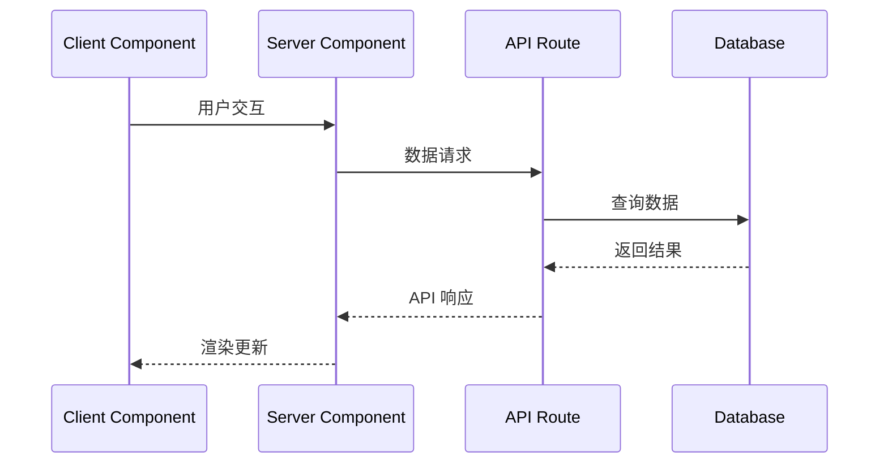
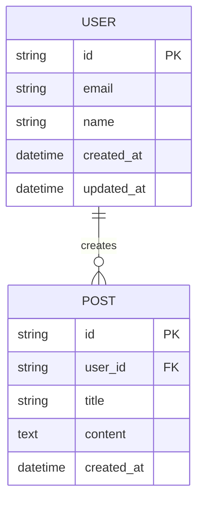

Next.js 全栈项目开发规范
## 基于需求驱动的全栈 Next.js 项目开发流程

本规范适用于使用 Next.js 框架的全栈 Web 应用开发，涵盖前端、后端 API、数据库设计等全栈开发流程。

### 1. 需求规格文档 (requirements.md)
存放地址: `/specs/<feature-name>/requirements.md`

#### Next.js 项目结构建议：
```
project-root/
├── app/                    # Next.js 13+ App Router
│   ├── (auth)/            # 路由组
│   ├── api/               # API 路由
│   ├── globals.css        # 全局样式
│   └── layout.tsx         # 根布局
├── components/            # 可复用组件
│   ├── ui/               # 基础 UI 组件
│   └── features/         # 功能组件
├── lib/                  # 工具库和配置
│   ├── auth.ts           # 认证配置
│   ├── db.ts             # 数据库连接
│   └── utils.ts          # 工具函数
├── spec/                 # 项目文档
│   └── <feature-name>/
│       ├── requirements.md
│       ├── design.md
│       └── tasks.md
├── public/               # 静态资源
├── types/                # TypeScript 类型定义
└── tests/                # 测试文件
```

#### 结构框架：
- **介绍**：简要说明功能背景和目标
- **需求**：按功能模块组织，每个需求包含：
  - **用户故事**：以"作为...我希望...以便..."的格式描述
  - **验收标准**：使用"WHEN...THEN...IF..."的格式描述具体行为

#### 编写要点：
- 使用中文描述，语言简洁明确
- 每个需求独立编号，便于追踪
- 验收标准要具体可测试
- 包含正常流程和异常处理
- 考虑边界条件和限制
- **避免技术实现细节**：专注于业务需求，不涉及具体技术方案
- **用户视角**：从最终用户角度描述功能，而非开发者角度

#### 示例结构：
```markdown
# 需求文档

## 介绍
[功能背景和目标说明]

## 需求

### 需求 1
**用户故事：** 作为[角色]，我希望[功能]，以便[价值]

#### 验收标准
1. WHEN [条件] THEN 系统 SHALL [行为]
2. WHEN [条件] THEN 系统 SHALL [行为]
3. IF [异常条件] THEN 系统 SHALL [处理方式]
```

### 2. 设计方案 (design.md)
存放地址: `/specs/<feature-name>/design.md`

#### 结构框架：
- **概述**：设计思路和 Next.js 架构原则
- **Next.js 架构**：App Router、API Routes、Server/Client Components 设计
- **前端架构**：组件层次、状态管理、路由设计
- **后端架构**：API 设计、中间件、数据库集成
- **数据模型**：数据库设计和实体关系
- **认证和授权**：NextAuth.js 或自定义认证方案
- **错误处理**：全局错误边界和 API 错误处理
- **测试策略**：Jest、React Testing Library、API 测试
- **安全考虑**：CSRF、XSS、数据验证
- **性能考虑**：SSR/SSG、缓存策略、图片优化

#### 编写要点：
- 使用Mermaid图表展示 Next.js 架构和组件交互流程
- **Next.js 最佳实践**：合理使用 Server/Client Components、App Router 特性
- **领域模型使用Mermaid类图**：描述实体关系和业务概念
- **数据模型使用Mermaid实体关系图**：支持 Prisma、Drizzle 等 ORM
- **API 设计**：遵循 RESTful 或 GraphQL 规范，考虑 Next.js API Routes
- **状态管理**：考虑 Zustand、Redux Toolkit 或 React Context
- **样式方案**：Tailwind CSS、CSS Modules 或 Styled Components
- 考虑可扩展性和维护性
- 包含错误处理和安全措施
- **性能优化**：SSR/SSG 策略、缓存、图片优化

#### 示例结构：
```markdown
# Next.js 全栈设计文档

## 概述
[设计思路和 Next.js 架构原则]

## Next.js 架构
### App Router 结构
```
app/
├── (auth)/
│   ├── login/
│   └── register/
├── dashboard/
│   ├── page.tsx
│   └── layout.tsx
├── api/
│   ├── auth/
│   └── users/
└── globals.css
```

### Server/Client Components 划分
- Server Components: 数据获取、SEO 优化
- Client Components: 交互、状态管理、浏览器 API

### 组件交互流程


## 前端架构
### 1. 组件层次
- UI Components: 基础可复用组件
- Feature Components: 业务功能组件
- Page Components: 页面级组件
- Layout Components: 布局组件

### 2. 状态管理
- 本地状态: useState, useReducer
- 全局状态: Zustand 或 Context API
- 服务端状态: React Query 或 SWR

### 3. 路由设计
- 使用 App Router 文件系统路由
- 路由组 (Route Groups) 组织相关页面
- 动态路由处理参数

## 后端架构
### 1. API Routes 设计
```
app/api/
├── auth/
│   ├── route.ts          # 认证相关
│   └── callback/
├── users/
│   ├── route.ts          # 用户 CRUD
│   └── [id]/
└── middleware.ts         # 全局中间件
```

### 2. 数据库集成
- ORM: Prisma 或 Drizzle
- 数据库: PostgreSQL, MySQL, SQLite
- 连接池和查询优化

## 数据模型
使用Mermaid实体关系图描述数据结构和关系：



## 认证和授权
### NextAuth.js 配置
- 支持的认证提供商
- JWT 或数据库会话
- 中间件保护路由

## 错误处理
### 全局错误边界
- error.tsx 页面级错误处理
- global-error.tsx 全局错误处理
- API 错误响应格式

## 测试策略
- 单元测试: Jest + React Testing Library
- 集成测试: API Routes 测试
- E2E 测试: Playwright 或 Cypress

## 性能优化
- 图片优化: next/image
- 字体优化: next/font
- 代码分割: 动态导入
- 缓存策略: ISR, SWR
```

### 3. 任务清单 (tasks.md)
存放地址: `/specs/<feature-name>/tasks.md`

#### 结构框架：
- 使用Markdown任务列表格式
- 按 Next.js 开发阶段组织任务（前端、后端、集成、测试）
- 每个任务包含具体描述和需求关联
- 使用复选框标记完成状态
- 包含 Next.js 特定的开发任务

#### 编写要点：
- 任务粒度适中，便于跟踪进度
- 按依赖关系排序任务（数据库 → API → 前端组件）
- 每个任务关联到具体需求
- 包含 Next.js 特定的测试和验证任务
- 使用中文描述任务内容
- 考虑 Server/Client Components 的划分
- 包含性能优化和 SEO 相关任务

#### 示例结构：
```markdown
# Next.js 全栈实施计划

## 阶段一：项目基础设置
- [x] 1. 初始化 Next.js 项目
  - 创建 Next.js 13+ 项目（App Router）
  - 配置 TypeScript 和 ESLint
  - 设置 Tailwind CSS 或样式方案
  - 配置 Prettier 代码格式化
  - _需求: 基础架构_

- [ ] 2. 数据库和 ORM 设置
  - [x] 2.1 配置 Prisma 或 Drizzle ORM
    - 初始化数据库连接
    - 配置环境变量
    - _需求: 数据持久化_
  
  - [ ] 2.2 创建数据模型
    - 定义 Prisma Schema 或 Drizzle 表结构
    - 运行数据库迁移
    - 编写种子数据脚本
    - _需求: 1.1, 1.2_

## 阶段二：后端 API 开发
- [ ] 3. 实现 API Routes
  - 创建用户认证 API (`/api/auth/`)
  - 实现用户管理 API (`/api/users/`)
  - 添加数据验证中间件
  - 实现错误处理机制
  - _需求: 2.1, 2.2_

- [ ] 4. 认证和授权
  - 配置 NextAuth.js 或自定义认证
  - 实现 JWT 或会话管理
  - 创建认证中间件
  - 保护需要认证的路由
  - _需求: 安全要求_

## 阶段三：前端组件开发
- [ ] 5. 创建基础 UI 组件
  - 实现可复用的 UI 组件库
  - 创建表单组件和验证
  - 实现响应式布局组件
  - _需求: UI/UX 要求_

- [ ] 6. 实现页面组件
  - 创建 Server Components 用于数据获取
  - 实现 Client Components 用于交互
  - 配置页面路由和布局
  - 添加 SEO 元数据
  - _需求: 3.1, 3.2_

## 阶段四：集成和优化
- [ ] 7. 状态管理集成
  - 配置 Zustand 或 Context API
  - 实现服务端状态管理（SWR/React Query）
  - 优化数据获取和缓存策略
  - _需求: 性能要求_

- [ ] 8. 性能优化
  - 配置图片优化（next/image）
  - 实现代码分割和懒加载
  - 添加缓存策略（ISR/SSG）
  - 优化 Core Web Vitals
  - _需求: 性能要求_

## 阶段五：测试和部署
- [ ] 9. 测试实现
  - 编写单元测试（Jest + RTL）
  - 实现 API 集成测试
  - 配置 E2E 测试（Playwright）
  - 设置测试覆盖率报告
  - _需求: 质量保证_

- [ ] 10. 部署准备
  - 配置生产环境变量
  - 优化构建配置
  - 设置 CI/CD 流水线
  - 配置监控和日志
  - _需求: 部署要求_
```

### 4. Next.js 全栈开发最佳实践

#### 文档编写：
1. **一致性**：保持 Next.js 术语和格式的一致性
2. **可读性**：使用清晰的中文表达，结合 Next.js 概念
3. **完整性**：覆盖前端、后端、数据库等全栈功能点
4. **可追溯性**：需求、设计、任务之间要有清晰的关联
5. **技术聚焦**：结合 Next.js 特性和最佳实践

#### 需求管理：
1. **用户导向**：从用户角度描述需求，考虑 SSR/SSG 场景
2. **可测试性**：验收标准要具体可验证，包含前端和后端测试
3. **优先级**：明确需求的优先级和依赖关系
4. **全栈视角**：考虑前端交互、API 设计、数据存储的完整流程
5. **性能导向**：需求中包含性能指标和用户体验要求

#### Next.js 设计原则：
1. **App Router 优先**：使用 Next.js 13+ App Router 架构
2. **Server/Client 分离**：合理划分 Server Components 和 Client Components
3. **API 设计**：遵循 RESTful 规范，充分利用 API Routes
4. **数据获取策略**：合理使用 SSR、SSG、ISR 等渲染策略
5. **性能优化**：内置图片优化、字体优化、代码分割等特性
6. **SEO 友好**：利用 Next.js 的 SEO 优化能力
7. **类型安全**：充分利用 TypeScript 类型系统

#### 开发工作流：
1. **渐进式开发**：按 Next.js 项目结构逐步实现
2. **测试驱动**：结合 Jest、RTL、Playwright 进行全栈测试
3. **热重载开发**：利用 Next.js 开发服务器的热重载特性
4. **代码质量**：使用 ESLint、Prettier、Husky 保证代码质量
5. **版本控制**：合理的 Git 工作流和分支策略

#### 部署和运维：
1. **Vercel 优化**：针对 Vercel 平台优化部署配置
2. **环境管理**：合理管理开发、测试、生产环境变量
3. **监控告警**：配置性能监控和错误追踪
4. **CI/CD 流水线**：自动化构建、测试、部署流程
5. **安全考虑**：API 安全、数据验证、认证授权

#### 性能优化策略：
1. **渲染策略**：根据数据更新频率选择合适的渲染方式
2. **缓存策略**：合理使用 Next.js 内置缓存和外部缓存
3. **资源优化**：图片、字体、CSS、JavaScript 的优化
4. **Core Web Vitals**：关注 LCP、FID、CLS 等关键指标
5. **代码分割**：动态导入和路由级别的代码分割

#### 团队协作：
1. **组件库**：建立可复用的 UI 组件库
2. **代码规范**：统一的代码风格和命名规范
3. **文档维护**：及时更新 API 文档和组件文档
4. **知识分享**：定期分享 Next.js 最佳实践和新技术
5. **代码审查**：建立有效的代码审查流程

这种基于 Next.js 的结构化开发方式有助于团队高效协作、保证代码质量，并充分利用 Next.js 框架的优势，确保全栈应用的可维护性和性能。