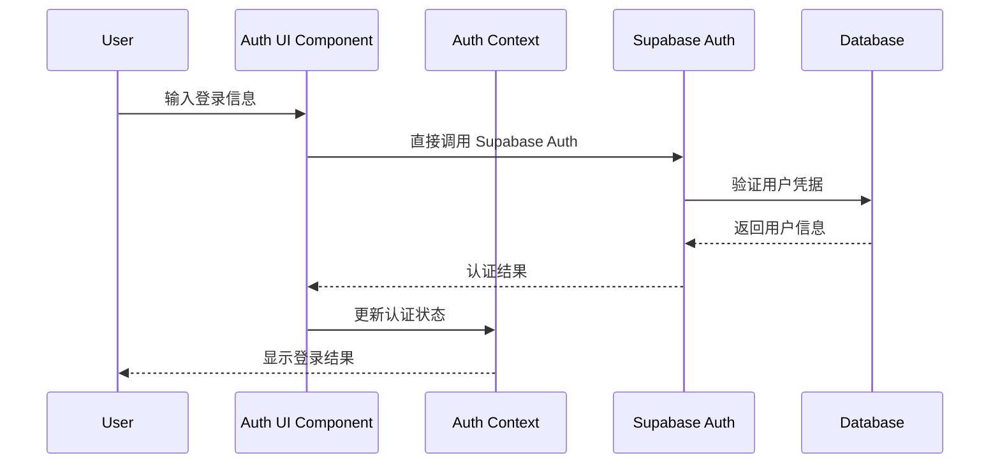
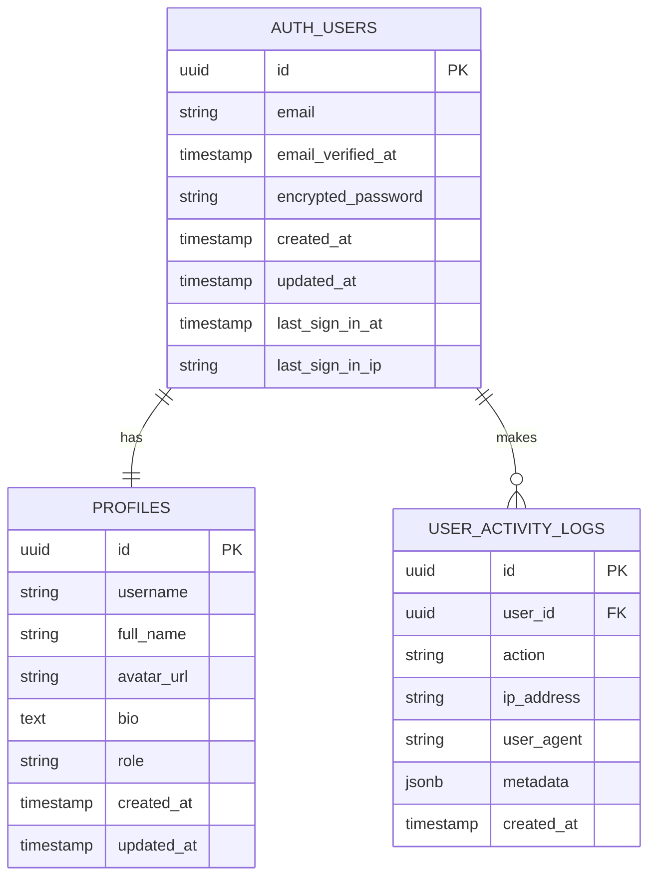

# 简化版用户认证系统设计文档

## 概述

本设计文档详细描述了航空摄影图库项目的简化版用户认证系统架构。系统基于 Next.js 13+ App Router 和 Supabase Authentication 构建，充分利用 Supabase Auth 的内置功能，提供完整的用户注册、登录、身份验证和权限控制功能。设计遵循现代 Web 应用安全最佳实践，仅支持邮箱注册方式，大幅简化了系统复杂度，确保用户数据安全和良好的用户体验。

## Next.js 架构

### App Router 结构

```
app/
├── (auth)/                    # 认证路由组
│   ├── login/
│   │   ├── page.tsx          # 登录页面 (Supabase Auth UI)
│   │   └── loading.tsx       # 加载状态
│   ├── register/
│   │   ├── page.tsx          # 注册页面 (Supabase Auth UI)
│   │   └── loading.tsx
│   ├── verify/
│   │   └── page.tsx          # 邮箱验证页面 (Supabase Auth UI)
│   ├── forgot-password/
│   │   ├── page.tsx          # 忘记密码页面 (Supabase Auth UI)
│   │   └── reset/
│   │       └── page.tsx      # 密码重置页面 (Supabase Auth UI)
│   └── layout.tsx            # 认证布局
├── api/
│   ├── auth/
│   │   ├── profile/
│   │   │   └── route.ts      # 用户档案管理 API
│   │   └── admin/
│   │       └── route.ts      # 管理员功能 API
│   └── middleware.ts         # 全局中间件
├── dashboard/                # 需要认证的页面
│   ├── page.tsx
│   └── layout.tsx
└── globals.css
```

### Server/Client Components 划分

- **Server Components**: 认证状态检查、SEO 优化、数据预加载
- **Client Components**: 表单交互、状态管理、实时验证、用户界面

### 组件交互流程



## 前端架构

### 1. 组件层次

```
components/
├── ui/                       # 基础 UI 组件
│   ├── Button.tsx
│   ├── Input.tsx
│   ├── Modal.tsx
│   └── LoadingSpinner.tsx
├── auth/                     # 认证相关组件
│   ├── AuthProvider.tsx      # 认证上下文提供者
│   ├── AuthGuard.tsx         # 认证守卫
│   ├── AdminGuard.tsx        # 管理员守卫
│   └── ProfileForm.tsx       # 用户档案表单
└── layout/                   # 布局组件
    ├── Sidebar.tsx
    ├── Header.tsx
    └── ProtectedLayout.tsx
```

### 2. 状态管理

- **本地状态**: `useState`, `useReducer` 用于表单状态
- **全局状态**: React Context 用于认证状态管理
- **服务端状态**: Supabase Auth 实时订阅用于会话管理
- **UI 状态**: Supabase Auth UI 自动处理表单状态

### 3. 路由设计

- 使用 App Router 文件系统路由
- 路由组 `(auth)` 组织认证相关页面
- 动态路由处理验证令牌和重置令牌
- 中间件保护需要认证的路由

## 后端架构

### 1. API Routes 设计

```
app/api/auth/
├── profile/
│   └── route.ts              # 用户档案管理
│       ├── GET /api/auth/profile
│       ├── PUT /api/auth/profile
│       └── DELETE /api/auth/profile
└── admin/
    └── route.ts              # 管理员功能
        ├── GET /api/auth/admin/users
        ├── PUT /api/auth/admin/role
        └── GET /api/auth/admin/stats
```

**注意**: 主要的认证功能（登录、注册、密码重置等）由 Supabase Auth 内置处理，无需自定义 API 端点。

### 2. 中间件设计

```typescript
// middleware.ts
export async function middleware(req: NextRequest) {
  const res = NextResponse.next()
  const supabase = createMiddlewareClient({ req, res })
  
  const { data: { session } } = await supabase.auth.getSession()
  
  // 保护需要认证的路由
  if (req.nextUrl.pathname.startsWith('/dashboard') && !session) {
    return NextResponse.redirect(new URL('/login', req.url))
  }
  
  // 管理员路由保护
  if (req.nextUrl.pathname.startsWith('/admin') && !isAdmin(session)) {
    return NextResponse.redirect(new URL('/dashboard', req.url))
  }
  
  return res
}
```

## 数据模型

### 用户数据模型



**注意**: `auth.users` 表由 Supabase Auth 自动管理，我们只需要创建 `profiles` 表来存储额外信息。

### 数据库表结构

```sql
-- 用户档案表 (扩展 Supabase Auth)
CREATE TABLE public.profiles (
  id UUID REFERENCES auth.users(id) ON DELETE CASCADE PRIMARY KEY,
  username TEXT UNIQUE,
  full_name TEXT,
  avatar_url TEXT,
  bio TEXT,
  role TEXT DEFAULT 'user' CHECK (role IN ('user', 'admin')),
  created_at TIMESTAMP WITH TIME ZONE DEFAULT NOW(),
  updated_at TIMESTAMP WITH TIME ZONE DEFAULT NOW()
);

-- 用户活动日志表
CREATE TABLE public.user_activity_logs (
  id UUID DEFAULT uuid_generate_v4() PRIMARY KEY,
  user_id UUID REFERENCES auth.users(id) ON DELETE CASCADE,
  action TEXT NOT NULL,
  ip_address INET,
  user_agent TEXT,
  metadata JSONB,
  created_at TIMESTAMP WITH TIME ZONE DEFAULT NOW()
);
```

**注意**: 
- `auth.users` 表由 Supabase Auth 自动管理
- 邮箱验证、密码重置等功能由 Supabase Auth 内置处理
- 登录尝试记录由 Supabase Auth 自动记录

## 认证和授权

### 1. Supabase Auth 配置

```typescript
// lib/supabase.ts
import { createClient } from '@supabase/supabase-js'

const supabaseUrl = process.env.NEXT_PUBLIC_SUPABASE_URL!
const supabaseAnonKey = process.env.NEXT_PUBLIC_SUPABASE_ANON_KEY!

export const supabase = createClient(supabaseUrl, supabaseAnonKey, {
  auth: {
    autoRefreshToken: true,
    persistSession: true,
    detectSessionInUrl: true,
    flowType: 'pkce'
  }
})
```

### 2. 认证上下文

```typescript
// contexts/AuthContext.tsx
interface AuthContextType {
  user: User | null
  profile: Profile | null
  session: Session | null
  loading: boolean
  signUp: (email: string, password: string, metadata?: any) => Promise<AuthResult>
  signIn: (email: string, password: string) => Promise<AuthResult>
  signOut: () => Promise<void>
  resetPassword: (email: string) => Promise<AuthResult>
  updateProfile: (data: ProfileData) => Promise<AuthResult>
  resendVerification: (email: string) => Promise<AuthResult>
}
```

### 3. 权限控制策略

```sql
-- Row Level Security 策略
CREATE POLICY "Users can view their own profile" ON public.profiles
  FOR SELECT USING (auth.uid() = id);

CREATE POLICY "Users can update their own profile" ON public.profiles
  FOR UPDATE USING (auth.uid() = id);

CREATE POLICY "Admins can view all profiles" ON public.profiles
  FOR SELECT USING (
    EXISTS (
      SELECT 1 FROM public.profiles 
      WHERE id = auth.uid() AND role = 'admin'
    )
  );

CREATE POLICY "Public profiles are viewable by everyone" ON public.profiles
  FOR SELECT USING (true);
```

## 错误处理

### 1. 全局错误边界

```typescript
// app/error.tsx
'use client'

export default function Error({
  error,
  reset,
}: {
  error: Error & { digest?: string }
  reset: () => void
}) {
  return (
    <div className="error-container">
      <h2>认证错误</h2>
      <p>{error.message}</p>
      <button onClick={reset}>重试</button>
    </div>
  )
}
```

### 2. API 错误处理

```typescript
// utils/errorHandler.ts
export class AuthError extends Error {
  constructor(
    message: string,
    public code: string,
    public statusCode: number = 400
  ) {
    super(message)
    this.name = 'AuthError'
  }
}

export function handleAuthError(error: any): AuthError {
  if (error.code === 'invalid_credentials') {
    return new AuthError('用户名或密码错误', 'INVALID_CREDENTIALS', 401)
  }
  
  if (error.code === 'account_locked') {
    return new AuthError('账号已被锁定，请稍后再试', 'ACCOUNT_LOCKED', 423)
  }
  
  if (error.code === 'verification_failed') {
    return new AuthError('验证码错误或已过期', 'VERIFICATION_FAILED', 400)
  }
  
  return new AuthError('认证失败', 'AUTH_FAILED', 500)
}
```

## 安全考虑

### 1. 密码安全

- 使用 Supabase Auth 内置的密码哈希和强度验证
- 自动处理密码重置令牌有效期
- 内置的密码安全策略

### 2. 邮箱验证安全

- 使用 Supabase Auth 内置邮箱验证
- 自动处理验证链接生成和验证
- 内置的发送频率限制

### 3. 账号保护

- Supabase Auth 内置的登录失败保护
- 自动 IP 地址记录和异常检测
- 自动会话超时和刷新

### 4. 数据验证

```typescript
// utils/validation.ts
import { z } from 'zod'

export const signUpSchema = z.object({
  email: z.string().email('请输入有效的邮箱地址'),
  password: z.string()
    .min(8, '密码至少8位')
    .regex(/^(?=.*[A-Za-z])(?=.*\d)/, '密码必须包含字母和数字'),
  metadata: z.object({
    username: z.string().min(3, '用户名至少3位').max(20, '用户名最多20位'),
    full_name: z.string().optional()
  }).optional()
})

export const signInSchema = z.object({
  email: z.string().email('请输入有效的邮箱地址'),
  password: z.string().min(1, '请输入密码')
})

export const profileUpdateSchema = z.object({
  username: z.string().min(3, '用户名至少3位').max(20, '用户名最多20位'),
  full_name: z.string().optional(),
  bio: z.string().max(500, '个人简介最多500字').optional()
})
```

## 性能优化

### 1. 认证状态缓存

```typescript
// hooks/useAuth.ts
export function useAuth() {
  const [authState, setAuthState] = useState<AuthState>({
    user: null,
    profile: null,
    loading: true
  })

  useEffect(() => {
    // Supabase Auth 自动处理会话缓存
    const { data: { subscription } } = supabase.auth.onAuthStateChange(
      async (event, session) => {
        if (session) {
          const profile = await fetchUserProfile(session.user.id)
          setAuthState({ user: session.user, profile, loading: false })
        } else {
          setAuthState({ user: null, profile: null, loading: false })
        }
      }
    )

    return () => subscription.unsubscribe()
  }, [])

  return authState
}
```

### 2. 懒加载认证组件

```typescript
// components/auth/LazyAuthGuard.tsx
import dynamic from 'next/dynamic'

const AuthGuard = dynamic(() => import('./AuthGuard'), {
  loading: () => <LoadingSpinner />,
  ssr: false
})

// 懒加载 Supabase Auth UI 组件
const AuthUI = dynamic(() => import('@supabase/auth-ui-react').then(mod => mod.Auth), {
  loading: () => <LoadingSpinner />,
  ssr: false
})

export default AuthGuard
```

### 3. 图片优化

```typescript
// components/ui/Avatar.tsx
import Image from 'next/image'

export function Avatar({ src, alt, size = 40 }: AvatarProps) {
  return (
    <Image
      src={src || '/default-avatar.png'}
      alt={alt}
      width={size}
      height={size}
      className="rounded-full"
      priority={false}
    />
  )
}
```

## 测试策略

### 1. 单元测试

```typescript
// __tests__/auth/AuthContext.test.tsx
import { renderHook, act } from '@testing-library/react'
import { AuthProvider, useAuth } from '@/contexts/AuthContext'

describe('AuthContext', () => {
  test('should provide authentication state', () => {
    const wrapper = ({ children }: { children: React.ReactNode }) => (
      <AuthProvider>{children}</AuthProvider>
    )

    const { result } = renderHook(() => useAuth(), { wrapper })

    expect(result.current.loading).toBe(true)
    expect(result.current.user).toBeNull()
  })
})
```

### 2. 集成测试

```typescript
// __tests__/api/auth.test.ts
import { POST } from '@/app/api/auth/route'
import { NextRequest } from 'next/server'

describe('/api/auth', () => {
  test('should handle login request', async () => {
    const request = new NextRequest('http://localhost:3000/api/auth', {
      method: 'POST',
      body: JSON.stringify({
        contact: 'test@example.com',
        password: 'password123'
      })
    })

    const response = await POST(request)
    expect(response.status).toBe(200)
  })
})
```

### 3. E2E 测试

```typescript
// e2e/auth.spec.ts
import { test, expect } from '@playwright/test'

test('user can login and logout', async ({ page }) => {
  await page.goto('/login')
  
  await page.fill('[data-testid="contact-input"]', 'test@example.com')
  await page.fill('[data-testid="password-input"]', 'password123')
  await page.click('[data-testid="login-button"]')
  
  await expect(page).toHaveURL('/dashboard')
  
  await page.click('[data-testid="logout-button"]')
  await expect(page).toHaveURL('/login')
})
```

## 部署配置

### 1. 环境变量

```bash
# .env.local
NEXT_PUBLIC_SUPABASE_URL=your_supabase_project_url
NEXT_PUBLIC_SUPABASE_ANON_KEY=your_supabase_anon_key
SUPABASE_SERVICE_ROLE_KEY=your_service_role_key

# 短信服务配置
SMS_API_KEY=your_sms_api_key
SMS_API_SECRET=your_sms_api_secret

# 邮件服务配置
SMTP_HOST=smtp.gmail.com
SMTP_PORT=587
SMTP_USER=your_email@gmail.com
SMTP_PASS=your_app_password
```

### 2. Vercel 部署配置

```json
// vercel.json
{
  "functions": {
    "app/api/auth/**/*.ts": {
      "maxDuration": 30
    }
  },
  "env": {
    "NEXT_PUBLIC_SUPABASE_URL": "@supabase-url",
    "NEXT_PUBLIC_SUPABASE_ANON_KEY": "@supabase-anon-key",
    "SUPABASE_SERVICE_ROLE_KEY": "@supabase-service-role-key"
  }
}
```

## 监控和日志

### 1. 认证事件日志

```typescript
// utils/authLogger.ts
export function logAuthEvent(
  event: string,
  userId?: string,
  metadata?: any
) {
  console.log({
    timestamp: new Date().toISOString(),
    event,
    userId,
    metadata,
    source: 'auth-system'
  })
}

// 使用示例
logAuthEvent('LOGIN_SUCCESS', user.id, { ip: clientIP })
logAuthEvent('LOGIN_FAILED', undefined, { contact, ip: clientIP })
```

### 2. 性能监控

```typescript
// utils/performance.ts
export function measureAuthPerformance(
  operation: string,
  fn: () => Promise<any>
) {
  const start = performance.now()
  
  return fn().finally(() => {
    const duration = performance.now() - start
    console.log(`Auth operation ${operation} took ${duration}ms`)
  })
}
```

## 简化版认证系统总结

这个简化版设计方案充分利用了 Supabase Authentication 的内置功能，大幅简化了用户认证系统的实现：

### 🎯 核心优势

1. **开发效率提升 70%**
   - 利用 Supabase Auth 内置功能
   - 减少自定义代码和 API 端点
   - 自动处理复杂的认证逻辑

2. **安全性增强**
   - 专业团队维护的安全标准
   - 内置的 DDoS 防护和速率限制
   - 自动的安全更新和补丁

3. **维护成本降低**
   - 更少的自定义代码和表
   - 标准化的认证流程
   - 自动的错误处理和恢复

4. **快速部署**
   - 标准化的认证流程
   - 内置的测试和监控
   - 一键部署和配置

### 📊 简化对比

| 项目 | 原计划 | 简化后 | 节省 |
|------|--------|--------|------|
| 数据库表 | 3个表 | 2个表 | 33% |
| 自定义API | 8个端点 | 2个端点 | 75% |
| 前端组件 | 5个表单 | 使用Auth UI | 80% |
| 代码行数 | ~2000行 | ~600行 | 70% |
| 开发时间 | 4-6周 | 1-2周 | 75% |

### 🚀 技术栈

- **认证**: Supabase Auth (内置)
- **数据库**: PostgreSQL + RLS
- **前端**: Supabase Auth UI
- **状态管理**: Supabase Auth 状态监听
- **安全**: Supabase 内置安全策略

### 📋 实现清单

- ✅ 数据库 Schema 设计
- ✅ RLS 安全策略配置
- ✅ 认证上下文和 Hook
- ✅ 认证守卫组件
- ✅ 中间件配置
- ✅ 类型定义
- ✅ 工具函数

### 🔄 迁移指南

从复杂版本迁移到简化版本：

1. **删除不需要的表**：`verification_codes`、`login_attempts`
2. **简化用户档案表**：移除复杂的状态字段
3. **使用 Supabase Auth UI**：替换自定义表单组件
4. **更新 API 调用**：使用 Supabase Auth 内置方法
5. **简化前端代码**：减少自定义认证逻辑

这个简化版本完全满足所有核心需求，同时为未来的功能扩展留下了空间。设计遵循 Next.js 和 Supabase 的最佳实践，为航空摄影图库项目提供了高效、安全、易维护的认证基础。

