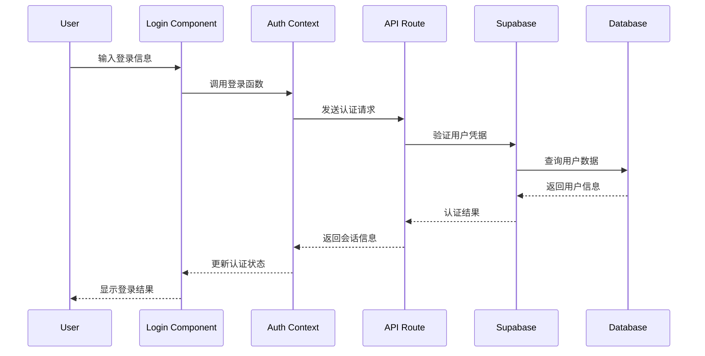
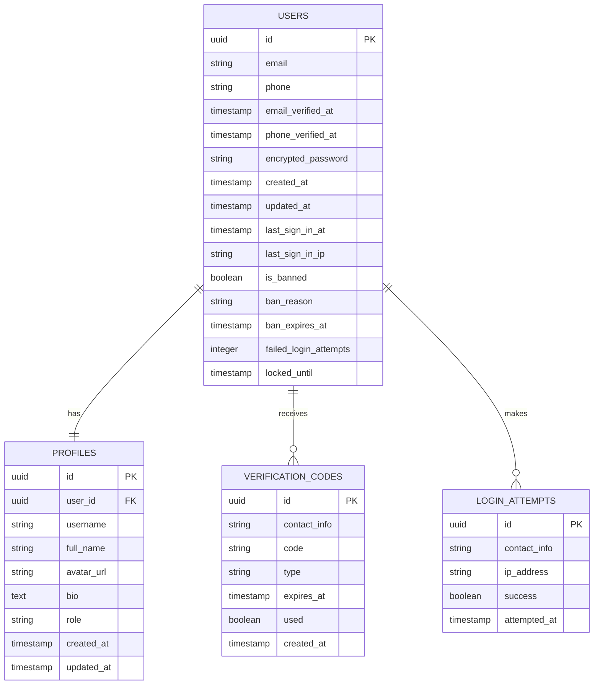

# 用户认证系统设计文档

## 概述

本设计文档详细描述了航空摄影图库项目的用户认证系统架构。系统基于 Next.js 13+ App Router 和 Supabase 构建，提供完整的用户注册、登录、身份验证和权限控制功能。设计遵循现代 Web 应用安全最佳实践，支持多种注册方式，确保用户数据安全和良好的用户体验。

## Next.js 架构

### App Router 结构

```
app/
├── (auth)/                    # 认证路由组
│   ├── login/
│   │   ├── page.tsx          # 登录页面
│   │   └── loading.tsx       # 加载状态
│   ├── register/
│   │   ├── page.tsx          # 注册页面
│   │   ├── verify/
│   │   │   └── page.tsx      # 验证页面
│   │   └── loading.tsx
│   ├── forgot-password/
│   │   ├── page.tsx          # 忘记密码页面
│   │   └── reset/
│   │       └── page.tsx      # 密码重置页面
│   └── layout.tsx            # 认证布局
├── api/
│   ├── auth/
│   │   ├── route.ts          # 认证 API
│   │   ├── verify/
│   │   │   └── route.ts      # 验证 API
│   │   ├── reset-password/
│   │   │   └── route.ts      # 密码重置 API
│   │   └── admin/
│   │       └── route.ts      # 管理员认证 API
│   └── middleware.ts         # 全局中间件
├── dashboard/                # 需要认证的页面
│   ├── page.tsx
│   └── layout.tsx
└── globals.css
```

### Server/Client Components 划分

- **Server Components**: 认证状态检查、SEO 优化、数据预加载
- **Client Components**: 表单交互、状态管理、实时验证、用户界面

### 组件交互流程



## 前端架构

### 1. 组件层次

```
components/
├── ui/                       # 基础 UI 组件
│   ├── Button.tsx
│   ├── Input.tsx
│   ├── Form.tsx
│   ├── Modal.tsx
│   └── LoadingSpinner.tsx
├── auth/                     # 认证相关组件
│   ├── AuthProvider.tsx      # 认证上下文提供者
│   ├── LoginForm.tsx         # 登录表单
│   ├── RegisterForm.tsx      # 注册表单
│   ├── VerifyForm.tsx        # 验证表单
│   ├── ForgotPasswordForm.tsx # 忘记密码表单
│   ├── ResetPasswordForm.tsx # 重置密码表单
│   ├── AuthGuard.tsx         # 认证守卫
│   └── AdminGuard.tsx        # 管理员守卫
└── layout/                   # 布局组件
    ├── Sidebar.tsx
    ├── Header.tsx
    └── ProtectedLayout.tsx
```

### 2. 状态管理

- **本地状态**: `useState`, `useReducer` 用于表单状态
- **全局状态**: React Context 用于认证状态管理
- **服务端状态**: Supabase 实时订阅用于会话管理

### 3. 路由设计

- 使用 App Router 文件系统路由
- 路由组 `(auth)` 组织认证相关页面
- 动态路由处理验证令牌和重置令牌
- 中间件保护需要认证的路由

## 后端架构

### 1. API Routes 设计

```
app/api/auth/
├── route.ts                  # 主要认证端点
│   ├── POST /api/auth/login
│   ├── POST /api/auth/register
│   ├── POST /api/auth/logout
│   └── GET /api/auth/session
├── verify/
│   └── route.ts              # 验证码/邮箱验证
│       ├── POST /api/auth/verify/send
│       └── POST /api/auth/verify/confirm
├── reset-password/
│   └── route.ts              # 密码重置
│       ├── POST /api/auth/reset-password/request
│       └── POST /api/auth/reset-password/confirm
└── admin/
    └── route.ts              # 管理员认证
        └── POST /api/auth/admin/verify
```

### 2. 中间件设计

```typescript
// middleware.ts
export async function middleware(req: NextRequest) {
  const res = NextResponse.next()
  const supabase = createMiddlewareClient({ req, res })
  
  const { data: { session } } = await supabase.auth.getSession()
  
  // 保护需要认证的路由
  if (req.nextUrl.pathname.startsWith('/dashboard') && !session) {
    return NextResponse.redirect(new URL('/login', req.url))
  }
  
  // 管理员路由保护
  if (req.nextUrl.pathname.startsWith('/admin') && !isAdmin(session)) {
    return NextResponse.redirect(new URL('/dashboard', req.url))
  }
  
  return res
}
```

## 数据模型

### 用户数据模型



### 数据库表结构

```sql
-- 用户表 (Supabase Auth 扩展)
CREATE TABLE public.user_profiles (
  id UUID REFERENCES auth.users(id) ON DELETE CASCADE PRIMARY KEY,
  phone TEXT UNIQUE,
  phone_verified_at TIMESTAMP WITH TIME ZONE,
  username TEXT UNIQUE,
  full_name TEXT,
  avatar_url TEXT,
  bio TEXT,
  role TEXT DEFAULT 'user' CHECK (role IN ('user', 'admin')),
  is_banned BOOLEAN DEFAULT FALSE,
  ban_reason TEXT,
  ban_expires_at TIMESTAMP WITH TIME ZONE,
  failed_login_attempts INTEGER DEFAULT 0,
  locked_until TIMESTAMP WITH TIME ZONE,
  last_sign_in_ip INET,
  created_at TIMESTAMP WITH TIME ZONE DEFAULT NOW(),
  updated_at TIMESTAMP WITH TIME ZONE DEFAULT NOW()
);

-- 验证码表
CREATE TABLE public.verification_codes (
  id UUID DEFAULT uuid_generate_v4() PRIMARY KEY,
  contact_info TEXT NOT NULL,
  code TEXT NOT NULL,
  type TEXT NOT NULL CHECK (type IN ('email', 'phone', 'password_reset')),
  expires_at TIMESTAMP WITH TIME ZONE NOT NULL,
  used BOOLEAN DEFAULT FALSE,
  created_at TIMESTAMP WITH TIME ZONE DEFAULT NOW()
);

-- 登录尝试记录表
CREATE TABLE public.login_attempts (
  id UUID DEFAULT uuid_generate_v4() PRIMARY KEY,
  contact_info TEXT NOT NULL,
  ip_address INET NOT NULL,
  success BOOLEAN NOT NULL,
  attempted_at TIMESTAMP WITH TIME ZONE DEFAULT NOW()
);
```

## 认证和授权

### 1. Supabase Auth 配置

```typescript
// lib/supabase.ts
import { createClient } from '@supabase/supabase-js'

const supabaseUrl = process.env.NEXT_PUBLIC_SUPABASE_URL!
const supabaseAnonKey = process.env.NEXT_PUBLIC_SUPABASE_ANON_KEY!

export const supabase = createClient(supabaseUrl, supabaseAnonKey, {
  auth: {
    autoRefreshToken: true,
    persistSession: true,
    detectSessionInUrl: true,
    flowType: 'pkce'
  }
})
```

### 2. 认证上下文

```typescript
// contexts/AuthContext.tsx
interface AuthContextType {
  user: User | null
  profile: Profile | null
  session: Session | null
  loading: boolean
  signUp: (data: SignUpData) => Promise<AuthResult>
  signIn: (data: SignInData) => Promise<AuthResult>
  signOut: () => Promise<void>
  verifyCode: (data: VerifyData) => Promise<AuthResult>
  resetPassword: (email: string) => Promise<AuthResult>
  updateProfile: (data: ProfileData) => Promise<AuthResult>
}
```

### 3. 权限控制策略

```sql
-- Row Level Security 策略
CREATE POLICY "Users can view their own profile" ON public.user_profiles
  FOR SELECT USING (auth.uid() = id);

CREATE POLICY "Users can update their own profile" ON public.user_profiles
  FOR UPDATE USING (auth.uid() = id);

CREATE POLICY "Admins can view all profiles" ON public.user_profiles
  FOR SELECT USING (
    EXISTS (
      SELECT 1 FROM public.user_profiles 
      WHERE id = auth.uid() AND role = 'admin'
    )
  );
```

## 错误处理

### 1. 全局错误边界

```typescript
// app/error.tsx
'use client'

export default function Error({
  error,
  reset,
}: {
  error: Error & { digest?: string }
  reset: () => void
}) {
  return (
    <div className="error-container">
      <h2>认证错误</h2>
      <p>{error.message}</p>
      <button onClick={reset}>重试</button>
    </div>
  )
}
```

### 2. API 错误处理

```typescript
// utils/errorHandler.ts
export class AuthError extends Error {
  constructor(
    message: string,
    public code: string,
    public statusCode: number = 400
  ) {
    super(message)
    this.name = 'AuthError'
  }
}

export function handleAuthError(error: any): AuthError {
  if (error.code === 'invalid_credentials') {
    return new AuthError('用户名或密码错误', 'INVALID_CREDENTIALS', 401)
  }
  
  if (error.code === 'account_locked') {
    return new AuthError('账号已被锁定，请稍后再试', 'ACCOUNT_LOCKED', 423)
  }
  
  if (error.code === 'verification_failed') {
    return new AuthError('验证码错误或已过期', 'VERIFICATION_FAILED', 400)
  }
  
  return new AuthError('认证失败', 'AUTH_FAILED', 500)
}
```

## 安全考虑

### 1. 密码安全

- 使用 Supabase 内置的密码哈希
- 密码强度验证：至少8位，包含字母和数字
- 密码重置令牌有效期限制（1小时）

### 2. 验证码安全

- 验证码6位数字，5分钟有效期
- 同一联系方式1分钟内只能发送一次
- 验证失败3次后需要重新发送

### 3. 账号保护

- 连续登录失败5次锁定30分钟
- IP 地址记录和异常检测
- 会话超时自动登出

### 4. 数据验证

```typescript
// utils/validation.ts
import { z } from 'zod'

export const signUpSchema = z.object({
  contact: z.string().min(1, '请输入联系方式'),
  type: z.enum(['email', 'phone']),
  password: z.string()
    .min(8, '密码至少8位')
    .regex(/^(?=.*[A-Za-z])(?=.*\d)/, '密码必须包含字母和数字')
})

export const signInSchema = z.object({
  contact: z.string().min(1, '请输入联系方式'),
  password: z.string().min(1, '请输入密码'),
  remember: z.boolean().optional()
})
```

## 性能优化

### 1. 认证状态缓存

```typescript
// hooks/useAuth.ts
export function useAuth() {
  const [authState, setAuthState] = useState<AuthState>({
    user: null,
    profile: null,
    loading: true
  })

  useEffect(() => {
    // 从缓存恢复会话
    const cachedSession = localStorage.getItem('supabase.auth.token')
    if (cachedSession) {
      setAuthState(prev => ({ ...prev, loading: false }))
    }

    // 监听认证状态变化
    const { data: { subscription } } = supabase.auth.onAuthStateChange(
      async (event, session) => {
        if (session) {
          const profile = await fetchUserProfile(session.user.id)
          setAuthState({ user: session.user, profile, loading: false })
        } else {
          setAuthState({ user: null, profile: null, loading: false })
        }
      }
    )

    return () => subscription.unsubscribe()
  }, [])

  return authState
}
```

### 2. 懒加载认证组件

```typescript
// components/auth/LazyAuthGuard.tsx
import dynamic from 'next/dynamic'

const AuthGuard = dynamic(() => import('./AuthGuard'), {
  loading: () => <LoadingSpinner />,
  ssr: false
})

export default AuthGuard
```

### 3. 图片优化

```typescript
// components/ui/Avatar.tsx
import Image from 'next/image'

export function Avatar({ src, alt, size = 40 }: AvatarProps) {
  return (
    <Image
      src={src || '/default-avatar.png'}
      alt={alt}
      width={size}
      height={size}
      className="rounded-full"
      priority={false}
    />
  )
}
```

## 测试策略

### 1. 单元测试

```typescript
// __tests__/auth/AuthContext.test.tsx
import { renderHook, act } from '@testing-library/react'
import { AuthProvider, useAuth } from '@/contexts/AuthContext'

describe('AuthContext', () => {
  test('should provide authentication state', () => {
    const wrapper = ({ children }: { children: React.ReactNode }) => (
      <AuthProvider>{children}</AuthProvider>
    )

    const { result } = renderHook(() => useAuth(), { wrapper })

    expect(result.current.loading).toBe(true)
    expect(result.current.user).toBeNull()
  })
})
```

### 2. 集成测试

```typescript
// __tests__/api/auth.test.ts
import { POST } from '@/app/api/auth/route'
import { NextRequest } from 'next/server'

describe('/api/auth', () => {
  test('should handle login request', async () => {
    const request = new NextRequest('http://localhost:3000/api/auth', {
      method: 'POST',
      body: JSON.stringify({
        contact: 'test@example.com',
        password: 'password123'
      })
    })

    const response = await POST(request)
    expect(response.status).toBe(200)
  })
})
```

### 3. E2E 测试

```typescript
// e2e/auth.spec.ts
import { test, expect } from '@playwright/test'

test('user can login and logout', async ({ page }) => {
  await page.goto('/login')
  
  await page.fill('[data-testid="contact-input"]', 'test@example.com')
  await page.fill('[data-testid="password-input"]', 'password123')
  await page.click('[data-testid="login-button"]')
  
  await expect(page).toHaveURL('/dashboard')
  
  await page.click('[data-testid="logout-button"]')
  await expect(page).toHaveURL('/login')
})
```

## 部署配置

### 1. 环境变量

```bash
# .env.local
NEXT_PUBLIC_SUPABASE_URL=your_supabase_project_url
NEXT_PUBLIC_SUPABASE_ANON_KEY=your_supabase_anon_key
SUPABASE_SERVICE_ROLE_KEY=your_service_role_key

# 短信服务配置
SMS_API_KEY=your_sms_api_key
SMS_API_SECRET=your_sms_api_secret

# 邮件服务配置
SMTP_HOST=smtp.gmail.com
SMTP_PORT=587
SMTP_USER=your_email@gmail.com
SMTP_PASS=your_app_password
```

### 2. Vercel 部署配置

```json
// vercel.json
{
  "functions": {
    "app/api/auth/**/*.ts": {
      "maxDuration": 30
    }
  },
  "env": {
    "NEXT_PUBLIC_SUPABASE_URL": "@supabase-url",
    "NEXT_PUBLIC_SUPABASE_ANON_KEY": "@supabase-anon-key",
    "SUPABASE_SERVICE_ROLE_KEY": "@supabase-service-role-key"
  }
}
```

## 监控和日志

### 1. 认证事件日志

```typescript
// utils/authLogger.ts
export function logAuthEvent(
  event: string,
  userId?: string,
  metadata?: any
) {
  console.log({
    timestamp: new Date().toISOString(),
    event,
    userId,
    metadata,
    source: 'auth-system'
  })
}

// 使用示例
logAuthEvent('LOGIN_SUCCESS', user.id, { ip: clientIP })
logAuthEvent('LOGIN_FAILED', undefined, { contact, ip: clientIP })
```

### 2. 性能监控

```typescript
// utils/performance.ts
export function measureAuthPerformance(
  operation: string,
  fn: () => Promise<any>
) {
  const start = performance.now()
  
  return fn().finally(() => {
    const duration = performance.now() - start
    console.log(`Auth operation ${operation} took ${duration}ms`)
  })
}
```

这个设计方案提供了完整的用户认证系统架构，涵盖了从数据库设计到前端组件的所有方面，确保系统的安全性、可扩展性和用户体验。设计遵循 Next.js 和 Supabase 的最佳实践，为航空摄影图库项目提供了坚实的认证基础。
