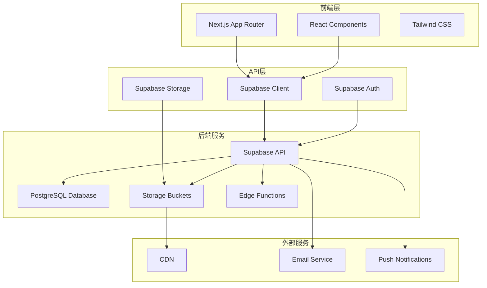
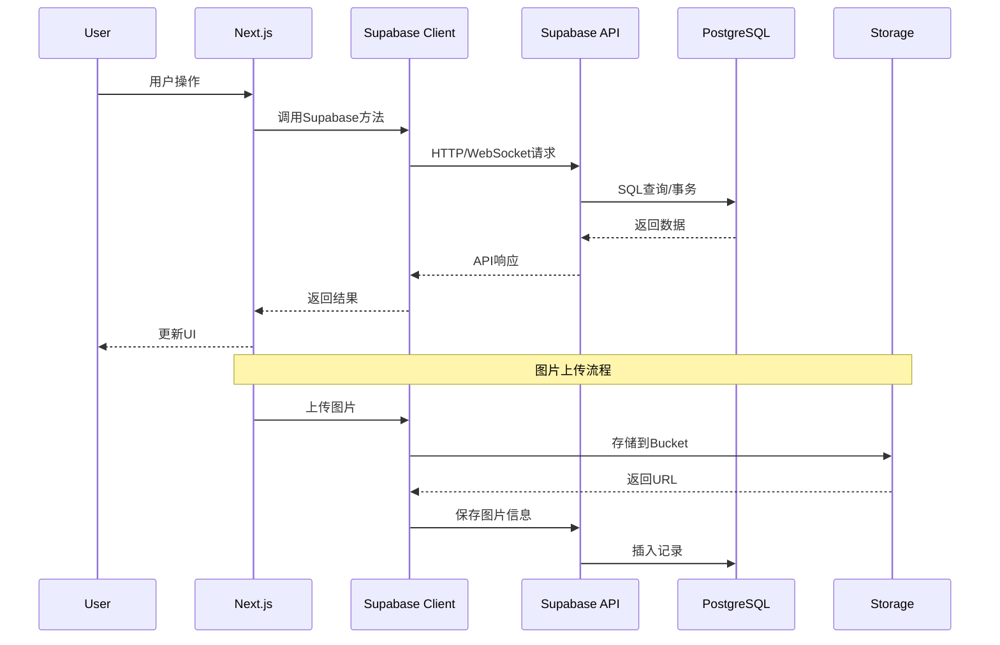
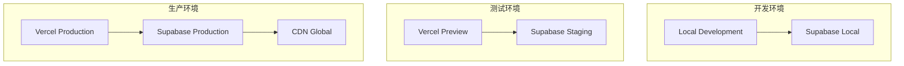

# 航空摄影图库网站技术架构文档

## 技术决策记录

### 决策概述

本文档记录了航空摄影图库网站的技术选型决策，特别是选择Supabase作为后端服务的详细原因和架构设计。

## 1. 后端技术选型：Supabase

### 1.1 决策背景

在评估航空摄影图库网站的后端技术方案时，我们考虑了以下关键需求：

- **快速开发**：需要快速构建MVP并迭代
- **全栈能力**：需要数据库、认证、存储、API等完整后端服务
- **成本控制**：项目初期需要控制基础设施成本
- **团队效率**：小团队需要减少运维复杂度
- **可扩展性**：未来需要支持大量图片存储和高并发访问

### 1.2 技术方案对比

| 方案 | 优势 | 劣势 | 适用场景 |
|------|------|------|----------|
| **传统后端** (Node.js + PostgreSQL) | 完全控制、灵活定制 | 开发周期长、运维复杂 | 大型企业项目 |
| **Firebase** | Google生态、实时功能强 | 文档数据库、成本高 | 实时应用 |
| **AWS Amplify** | AWS生态、功能全面 | 学习曲线陡峭、复杂 | 企业级应用 |
| **Supabase** | PostgreSQL、开源、成本低 | 相对较新、生态较小 | 快速开发、PostgreSQL项目 |

### 1.3 选择Supabase的核心原因

#### 1.3.1 PostgreSQL数据库优势
- **关系型数据库**：适合航空摄影图库的结构化数据存储
- **ACID特性**：确保数据一致性和事务完整性
- **成熟稳定**：PostgreSQL是业界认可的企业级数据库
- **SQL支持**：团队熟悉SQL，降低学习成本

#### 1.3.2 开箱即用的功能
- **认证系统**：内置用户注册、登录、JWT管理
- **实时订阅**：支持WebSocket实时数据更新
- **文件存储**：集成对象存储，支持图片上传和管理
- **API自动生成**：基于数据库schema自动生成RESTful API
- **Row Level Security (RLS)**：数据库级别的权限控制

#### 1.3.3 开发效率优势
- **快速原型**：无需搭建后端基础设施
- **类型安全**：自动生成TypeScript类型定义
- **实时协作**：支持多开发者协作开发
- **热重载**：开发环境支持实时更新

#### 1.3.4 成本效益
- **免费额度**：适合项目初期和MVP阶段
- **按需付费**：根据实际使用量付费
- **无隐藏费用**：透明的定价模式
- **开源核心**：避免供应商锁定风险

### 1.4 技术架构设计

#### 1.4.1 整体架构图



#### 1.4.2 数据流架构



### 1.5 核心功能实现方案

#### 1.5.1 用户认证系统
```typescript
// 使用Supabase Auth
import { createClient } from '@supabase/supabase-js'

const supabase = createClient(url, key)

// 用户注册
const { data, error } = await supabase.auth.signUp({
  email: 'user@example.com',
  password: 'password'
})

// 用户登录
const { data, error } = await supabase.auth.signInWithPassword({
  email: 'user@example.com',
  password: 'password'
})
```

#### 1.5.2 图片存储方案
```typescript
// 使用Supabase Storage
const { data, error } = await supabase.storage
  .from('aircraft-images')
  .upload('public/aircraft-123.jpg', file)

// 获取公开URL
const { data } = supabase.storage
  .from('aircraft-images')
  .getPublicUrl('public/aircraft-123.jpg')
```

#### 1.5.3 实时数据订阅
```typescript
// 实时订阅图片更新
const subscription = supabase
  .channel('images')
  .on('postgres_changes', 
    { event: 'INSERT', schema: 'public', table: 'images' },
    (payload) => {
      // 实时更新UI
      updateImageList(payload.new)
    }
  )
  .subscribe()
```

### 1.6 数据库设计

#### 1.6.1 核心表结构

```sql
-- 用户表 (使用Supabase Auth扩展)
CREATE TABLE profiles (
  id UUID REFERENCES auth.users(id) PRIMARY KEY,
  username TEXT UNIQUE,
  avatar_url TEXT,
  created_at TIMESTAMP WITH TIME ZONE DEFAULT NOW(),
  updated_at TIMESTAMP WITH TIME ZONE DEFAULT NOW()
);

-- 图片表
CREATE TABLE images (
  id UUID DEFAULT gen_random_uuid() PRIMARY KEY,
  user_id UUID REFERENCES profiles(id) NOT NULL,
  title TEXT NOT NULL,
  aircraft_registration TEXT NOT NULL,
  airline TEXT NOT NULL,
  airport TEXT NOT NULL,
  camera_model TEXT NOT NULL,
  aircraft_model TEXT NOT NULL,
  file_path TEXT NOT NULL,
  file_size BIGINT,
  mime_type TEXT,
  is_hot BOOLEAN DEFAULT FALSE,
  hot_reason TEXT,
  admin_notes TEXT,
  status TEXT DEFAULT 'pending' CHECK (status IN ('pending', 'approved', 'rejected')),
  rejection_reason TEXT,
  created_at TIMESTAMP WITH TIME ZONE DEFAULT NOW(),
  updated_at TIMESTAMP WITH TIME ZONE DEFAULT NOW()
);

-- 点赞表
CREATE TABLE likes (
  id UUID DEFAULT gen_random_uuid() PRIMARY KEY,
  user_id UUID REFERENCES profiles(id) NOT NULL,
  image_id UUID REFERENCES images(id) NOT NULL,
  created_at TIMESTAMP WITH TIME ZONE DEFAULT NOW(),
  UNIQUE(user_id, image_id)
);

-- 评论表
CREATE TABLE comments (
  id UUID DEFAULT gen_random_uuid() PRIMARY KEY,
  user_id UUID REFERENCES profiles(id) NOT NULL,
  image_id UUID REFERENCES images(id) NOT NULL,
  content TEXT NOT NULL,
  created_at TIMESTAMP WITH TIME ZONE DEFAULT NOW(),
  updated_at TIMESTAMP WITH TIME ZONE DEFAULT NOW()
);
```

#### 1.6.2 Row Level Security (RLS) 策略

```sql
-- 启用RLS
ALTER TABLE images ENABLE ROW LEVEL SECURITY;
ALTER TABLE likes ENABLE ROW LEVEL SECURITY;
ALTER TABLE comments ENABLE ROW LEVEL SECURITY;

-- 图片访问策略
CREATE POLICY "Public images are viewable by everyone" ON images
  FOR SELECT USING (status = 'approved');

CREATE POLICY "Users can insert their own images" ON images
  FOR INSERT WITH CHECK (auth.uid() = user_id);

CREATE POLICY "Users can update their own images" ON images
  FOR UPDATE USING (auth.uid() = user_id);

-- 管理员策略
CREATE POLICY "Admins can manage all images" ON images
  FOR ALL USING (
    EXISTS (
      SELECT 1 FROM profiles 
      WHERE id = auth.uid() 
      AND role = 'admin'
    )
  );
```

### 1.7 性能优化策略

#### 1.7.1 数据库优化
- **索引策略**：为常用查询字段创建索引
- **分页查询**：使用cursor-based分页处理大量数据
- **连接池**：利用Supabase的连接池管理
- **查询优化**：使用PostgreSQL的查询计划分析

#### 1.7.2 存储优化
- **CDN集成**：利用Supabase的全球CDN加速图片访问
- **图片压缩**：在上传时生成多种尺寸的缩略图
- **缓存策略**：使用Redis缓存热点数据
- **懒加载**：实现图片的渐进式加载

#### 1.7.3 前端优化
- **Next.js优化**：使用SSR/SSG提升首屏加载速度
- **图片优化**：使用next/image组件优化图片加载
- **代码分割**：按路由和功能分割代码
- **状态管理**：使用SWR或React Query缓存API数据

### 1.8 安全考虑

#### 1.8.1 数据安全
- **RLS策略**：数据库级别的权限控制
- **JWT认证**：安全的用户身份验证
- **HTTPS传输**：所有数据传输加密
- **输入验证**：前后端双重数据验证

#### 1.8.2 文件安全
- **文件类型验证**：严格限制上传文件类型
- **文件大小限制**：防止恶意大文件上传
- **病毒扫描**：集成文件安全检查
- **访问控制**：基于用户权限的文件访问控制

### 1.9 监控和运维

#### 1.9.1 监控指标
- **性能监控**：API响应时间、数据库查询性能
- **错误监控**：应用错误、数据库错误追踪
- **用户行为**：用户活跃度、功能使用统计
- **资源使用**：存储使用量、带宽消耗

#### 1.9.2 日志管理
- **应用日志**：使用Supabase的日志功能
- **错误日志**：集成Sentry等错误追踪服务
- **审计日志**：记录所有管理操作
- **性能日志**：记录慢查询和性能瓶颈

### 1.10 扩展性规划

#### 1.10.1 水平扩展
- **数据库分片**：当数据量增长时考虑分片策略
- **CDN扩展**：利用全球CDN节点
- **微服务拆分**：将复杂功能拆分为独立服务
- **缓存层**：添加Redis缓存层提升性能

#### 1.10.2 功能扩展
- **AI集成**：使用Supabase Edge Functions集成AI服务
- **实时通知**：扩展实时功能支持推送通知
- **数据分析**：集成数据分析工具
- **第三方集成**：支持更多第三方服务集成

## 2. 技术栈总结

### 2.1 前端技术栈
- **框架**：Next.js 14 (App Router)
- **UI库**：React 18 + Tailwind CSS
- **状态管理**：Zustand + SWR
- **类型检查**：TypeScript
- **代码质量**：ESLint + Prettier

### 2.2 后端技术栈
- **BaaS**：Supabase
- **数据库**：PostgreSQL
- **认证**：Supabase Auth
- **存储**：Supabase Storage
- **API**：Supabase REST API + GraphQL

### 2.3 开发工具
- **版本控制**：Git + GitHub
- **部署**：Vercel (前端) + Supabase (后端)
- **监控**：Supabase Dashboard + Sentry
- **测试**：Jest + React Testing Library + Playwright

### 2.4 部署架构



## 3. 风险评估与缓解

### 3.1 技术风险
- **供应商依赖**：Supabase服务中断风险
  - *缓解措施*：保持代码可移植性，准备迁移方案
- **性能瓶颈**：高并发访问时的性能问题
  - *缓解措施*：实施缓存策略，监控性能指标
- **数据安全**：敏感数据泄露风险
  - *缓解措施*：实施RLS策略，定期安全审计

### 3.2 业务风险
- **成本控制**：随着用户增长的成本增加
  - *缓解措施*：监控使用量，优化资源使用
- **功能限制**：Supabase功能限制影响业务发展
  - *缓解措施*：评估替代方案，准备技术迁移

## 4. 结论

选择Supabase作为后端服务是基于项目需求、团队能力和长期发展的综合考虑。Supabase提供了完整的后端解决方案，能够快速构建航空摄影图库网站，同时保持足够的灵活性和扩展性。

这个技术决策将显著提升开发效率，降低运维复杂度，并为项目的快速迭代和功能扩展提供坚实的技术基础。
